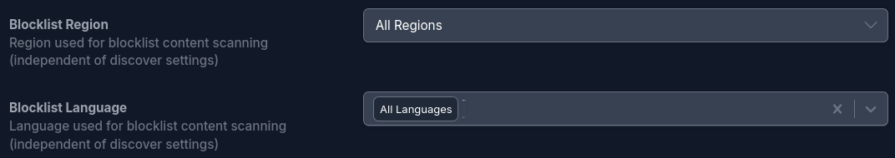
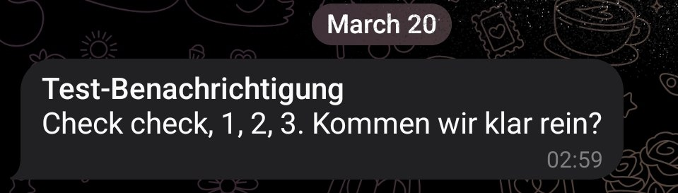
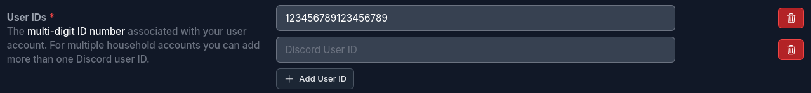

<!-- We are releasing **Seerr v3.3.0**,  -->
This release note covers both **v3.2.0** and **v3.3.0** releases, which include a host of new features, improvements, and bug fixes to enhance your Seerr experience.

We have been a bit busy recently and forgot to release the notes for **v3.2.0**, so this release note also includes the previous release notes for v3.2.0, which was released in the interim. Better late than never, right?

<!--truncate-->

Beyond the usual bug fixes and optimizations, here are some of the highlights from these releases:

## What's New?

### Blocklist Upgrades

With the new region and language settings, you can now tailor your blocklist to filter content based on specific regions or languages.

Moreover, you can now blocklist entire collections of media items, allowing you to filter out specific franchises, series, or groups of related content with ease.

### Expanded Language Support

In this release, we added a long-awaited feature: server-side internationalization (i18n) for all notification agents.
Notifications now automatically translate at send-time based on the recipient's language, with dedicated locale settings for Discord, Slack, Gotify, and ntfy—including a Discord toggle to match the requesting user's language.

We are continuously working to make the platform accessible to everyone, everywhere. This update expands our internationalization efforts by officially introducing full language support for **Estonian**, **Luxembourgish**, and **Vietnamese**.

### Notifications & Webhooks

Webhooks are also more powerful with support for custom headers and the inclusion of `imdbid` in payloads.

Additionally, **ntfy** users can now utilize rich Markdown formatting and custom priority settings.

Discord users can now also include multiple user or role IDs in the `User IDs` field, allowing for more flexible and targeted notifications.

### Other Enhancements & Quality of Life Improvements

- You can now choose to enable or disable the `monitorNewItems` option for Sonarr in the service settings.
- We added the ability to set an unlimited time for quota resets, allowing you to add a global request per user.
- In the user list, you can now sort your users by name, email, role, requests, and more to find the users you are looking for more easily.
- Filters on the trending page have been added to see only trending movies or TV shows, with the option to filter by the daily or weekly trending lists.
- Handy IMDb and TMDB links have been added directly on the person detail pages.

We've also officially promoted ourselves and removed the "BETA software" banner from the About Page. We are well past the beta phase and running with the big kids now.

You can find the full list of the new features and bug fixes in the [v3.2.0 release notes](https://github.com/seerr-team/seerr/releases/tag/v3.2.0) and the [v3.3.0 release notes](https://github.com/seerr-team/seerr/releases/tag/v3.3.0).

## New Contributors

Many thanks to those making their first contribution to Seerr in v3.2.0 and v3.3.0:

* [@aslafy-z](https://github.com/aslafy-z)
* [@leereilly](https://github.com/leereilly)
* [@jisef](https://github.com/jisef)
* [@dougrathbone](https://github.com/dougrathbone)
* [@bobziroll](https://github.com/bobziroll)
* [@v3DJG6GL](https://github.com/v3DJG6GL)
* [@Roboroads](https://github.com/Roboroads)
* [@costajohnt](https://github.com/costajohnt)
* [@tiagodefendi](https://github.com/tiagodefendi)
* [@Jyasapara](https://github.com/Jyasapara)
* [@Sym-jay](https://github.com/Sym-jay)
* [@bibi0019](https://github.com/bibi0019)
* [@redondos](https://github.com/redondos)
* [@bogo22](https://github.com/bogo22)
* [@jabloink](https://github.com/jabloink)
* [@YakGravity](https://github.com/YakGravity)
* [@dj0024javia](https://github.com/dj0024javia)
* [@Jerra94](https://github.com/Jerra94)
* [@its-wizza](https://github.com/its-wizza)
* [@ventiph](https://github.com/ventiph)
* [@RinZ27](https://github.com/RinZ27)
* [@aldoeliacim](https://github.com/aldoeliacim)
* [@danjuv](https://github.com/danjuv)
* [@kyle-engler](https://github.com/kyle-engler)
* [@Finchow](https://github.com/Finchow)
* [@Josh-Archer](https://github.com/Josh-Archer)
* [@marcinjurczak](https://github.com/marcinjurczak)
* [@fredrikburmester](https://github.com/fredrikburmester)
* [@death2all110](https://github.com/death2all110)
* [@burakemirsezen](https://github.com/burakemirsezen)
* [@felixschndr](https://github.com/felixschndr)
* [@haribo-hyung](https://github.com/haribo-hyung)
* [@defaultdino](https://github.com/defaultdino)
